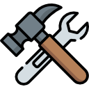
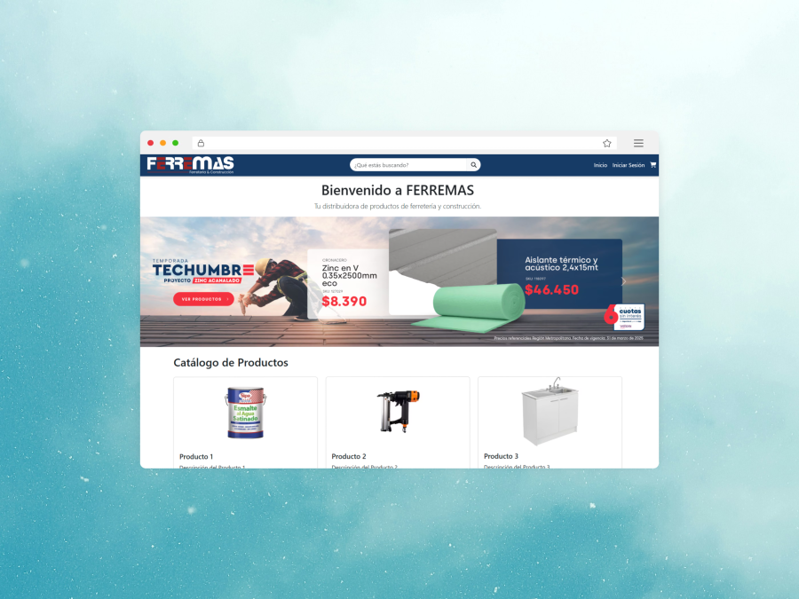
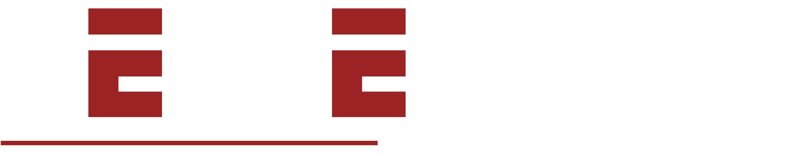
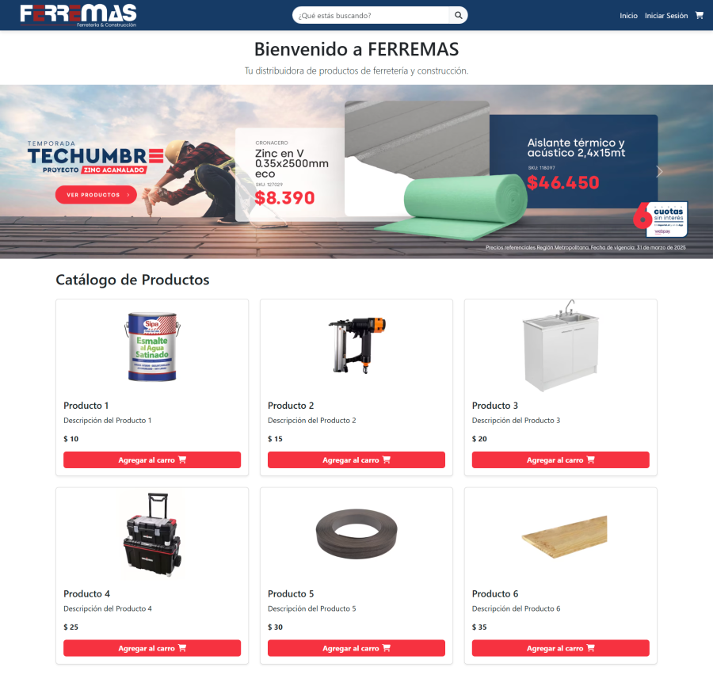
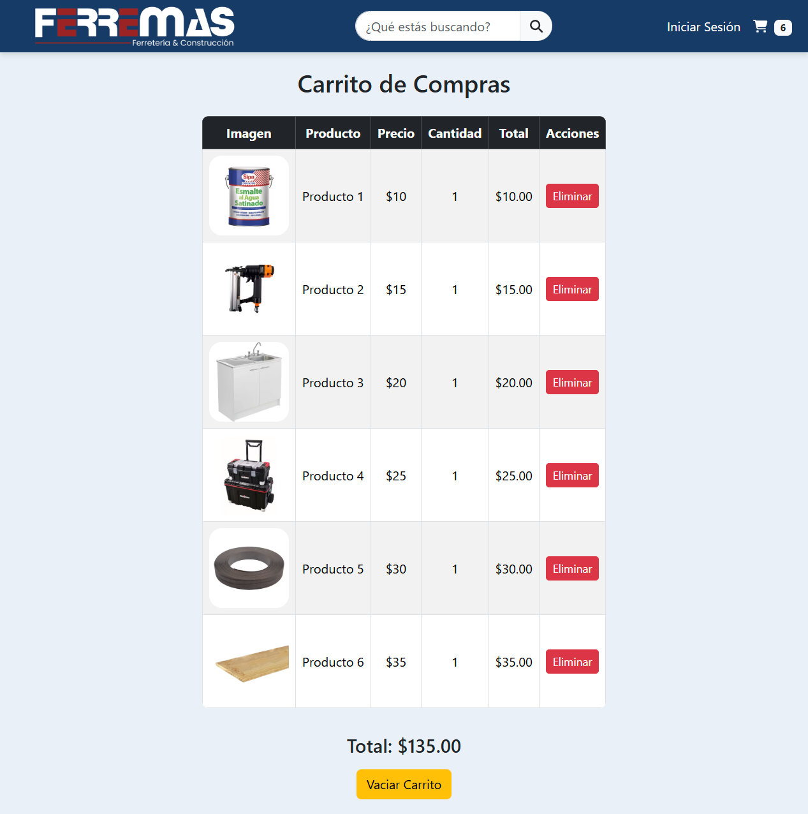

<div align="center">



# Ferremas

[](https://vite.dev/)

Sitio web de una ferretería ficticia para la asignatura de Integración de Plataformas.



</div>

## **Disclaimer**

El sitio web fue diseñado con fines educativos para una asignatura del instituto. Su contenido es ficticio y solo se utiliza para fines de enseñanza.



## Instalación

Para instalar el proyecto será necesario **abrir dos consolas**, una para el **Backend**, y otra para el **Frontend**, ambas corriendo **en paralelo**. A continuación se detalla cómo realizar el proceso:

Clona el repo y entra a la carpeta:

```bash
git clone https://github.com/ToBarrueto/ferremas
cd ferremas
```

---

### Frontend

Instala las dependencias:

```bash
npm install
```

Levanta el servidor de desarrollo:

```bash
npm run dev
```

Dejaremos el proceso corriendo, ahora **iniciaremos una nueva consola para el siguiente proceso**.

---

### Backend

Con la nueva consola (puede ser también una nueva pestaña corriendo en paralelo), ejecutaremos los siguientes comandos:

Primero entramos a la carpeta del backend.

```bash
cd backend
```

Ahora instalamos las dependencias de Python.

```bash
pip install django
pip install djangorestframework
```

Iniciamos el servidor de la API.

```bash
python manage.py runserver
```

Con eso el servidor del Backend debería estar funcinando, ahora sólo queda ir al siguiente paso que sería ir al link especificado en la consola del frontend.

Para ver la API rest del backend es posible consultar los siguientes enlaces:

- [localhost:8000/api/](http://127.0.0.1:8000/api/) para ver los enlaces disponibles.
- [localhost:800/api/products/](http://127.0.0.1:8000/api/products/) para ver los productos.
- [localhost:8000/api/users/](http://127.0.0.1:8000/api/users/) para ver los usuarios registrados.

---

### Sitio web funcionando

Ve al sitio local que se especifique en consola del Frontend, las llamadas al backend serán automáticas por tanto sólo queda ver la aplicación funcionando. 
- Por defecto es [localhost:5173](http://localhost:5173/)

### Credenciales

Para poder iniciar sesión serán necesarias las siguientes credenciales.

| Usuario | Clave |
|---|---|
| admin | 1234 |

## Tecnologías usadas

- React
- Vite
- Django

## Capturas de pantalla

### Sitio principal

<div align="center">
  
</div>

### Carrito de compras

<div align="center">
  
</div>

### Interacción con el carrito de compras

<div align="center">
  
</div>

## Referencias

- Imagen principal creada con MockupBro.
- Inspiado en [imperial.cl](https://www.imperial.cl/)
- [Icon by Freepik](https://www.freepik.com/icon/repair-tools_595742)